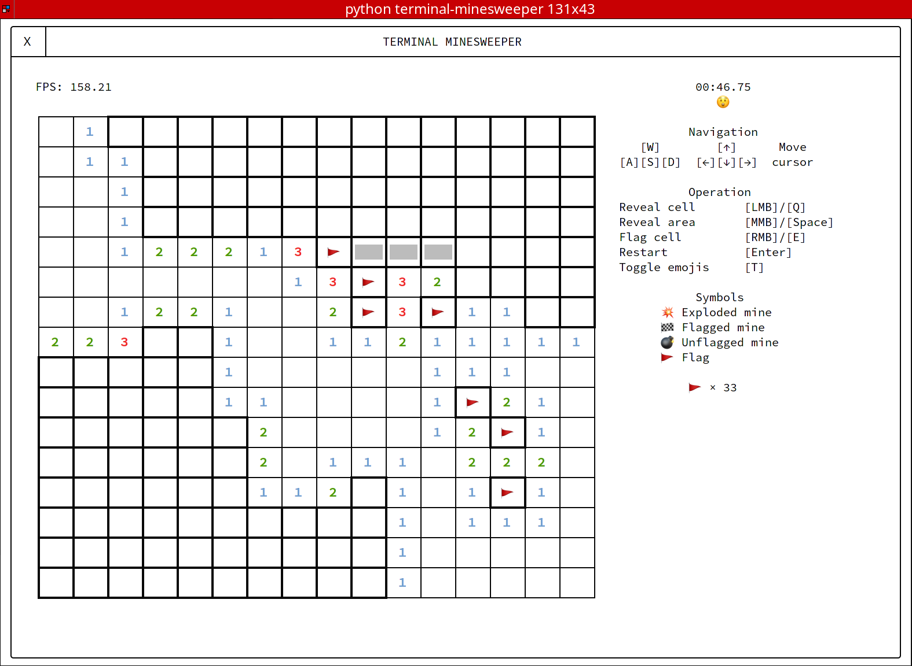
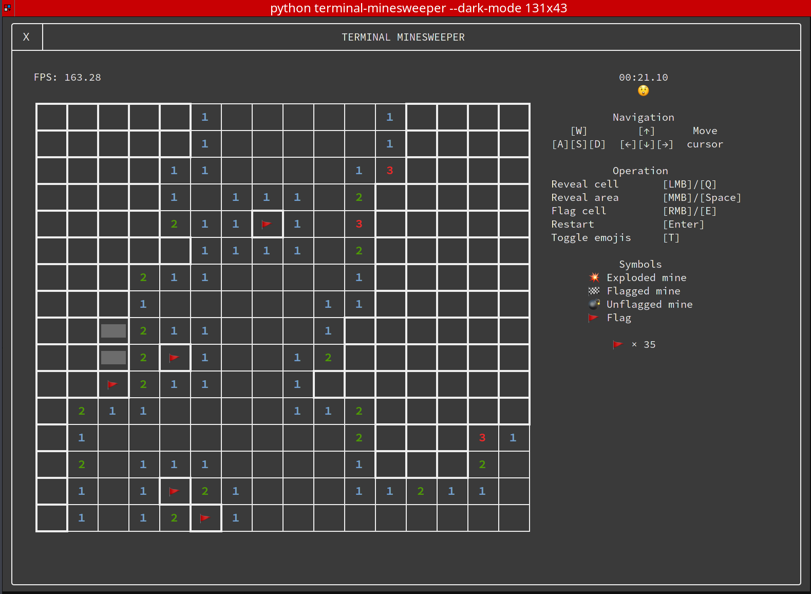

# Minesweeper, but in terminal

Feeling like playing some minesweeper in terminal, but don't want to stare at the REPL of most of the terminal 
minesweeper implementations? Here you go, that's what terminal minesweeper is here for. This program is written 
in Python with curses and no third party library. Compared to other implementations, this program undoubtedly
look significantly better



It also has a dark mode for people who refuses to embrace the Lord of Light



It supports all minesweeper operations including area reveals and highlights. So, what are you waiting for?
Let's sweep some mines!

## Install

From PyPI

```sh
python3 -m pip install terminal-minesweeper
```

Or, to install from source

```sh
git clone git@github.com:jeriewang/terminal-minesweeper
cd terminal-minesweeper
python3 setup.py install
```

## Run the game

```sh
minesweeper
```

Or, inside the cloned source directory

```sh
python3 -m minesweeper
```

A full list of command line options are included at the end of this document, which is the same as the one obtained with `minesweeper --help`. 

To skip the intro animations, run `minesweeper -q`. 

## Terminal Compatibilities

The following terminals are tested. Untested terminals may or may not work. 

Testing environments: 
    - macOS: 10.14.6, Python 3.8.0
    - Linux: Arch Linux 2020.11, Python 3.9.0
    - Windows: Windows 10 2004, Python 3.8.5
    - WSL: Ubuntu 20.04, Python 3.8.5

|                            | Keyboard | Mouse | Note                                                                                                                                     |
|----------------------------|----------|-------|------------------------------------------------------------------------------------------------------------------------------------------|
| Terminal (macOS)           | ✅        | ✅     | On trackpad, left click requires double clicking                                                                                         |
| iTerm2 (macOS)             | ✅        | ✅     | Right click opens up the iTerm menu instead of flagging the cell                                                                         |
|                            |          |       |                                                                                                                                          |
| Konsole (Linux)            | ✅        | ✅     | Does not highlight cell on hover due to an [open bug in KDE](https://bugs.kde.org/show_bug.cgi?id=423333), but you can still click on the cells |
| Terminator (Linux)         | ✅        | ✅     |                                                                                                                                          |
| Kitty (Linux)            |  ✅        |   ✅    |                                                                                                                                          |
|                            |          |       |                                                                                                                                          |
| cmd.exe (Windows)          | ✅        | ✅     | Except, `cmd.exe` doesn't display Unicode characters so you basically can't play it even under the alternative non-emoji mode.           |
| powershell.exe (Windows)   | ✅        | ✅     | See note above for `cmd.exe`                                                                                                             |
| Windows Terminal (Windows) | ❌        | ✅     |                                                                                                                                          |
|                            |          |       |                                                                                                                                          |
| Windows Terminal (WSL 2)   | ✅        | ✅     |                                                                                                                                          |
## Usage
```
usage: minesweeper [-e | -i | -h | -c WIDTH HEIGHT MINES] [-d]
                            [-f FRAMERATE] [--silent-checks] [--no-animation]
                            [-q] [--ignore-failures] [--no-emoji] [--debug]
                            [--help]

Options:
  -e, --easy            Set the game difficulty to easy (9x9 board with 10
                        mines)
  -i, --intermediate    Set the game difficulty to intermediate (16x16 board
                        with 40 mines). This is the default.
  -h, --hard            Set the game difficulty to hard (16x30 board with 99
                        mines).
  -c WIDTH HEIGHT MINES, --custom WIDTH HEIGHT MINES
                        Set a custom game difficulty.
  -d, --dark-mode       Enable dark mode.
  -f FRAMERATE, --framerate FRAMERATE
                        Cap the framerate. Set to 0 to disable, which is the
                        default.
  --silent-checks       Performs the initial system checks quickly and
                        quietly.
  --no-animation        Skip the startup and closing animations. May cause a
                        significant screen flicker when the program starts.
  -q, --quick           A shortcut argument that is the equivalent of
                        supplying both --silent-checks and --no-animation.
  --ignore-failures     Ignore all failures in the initial system checks. Not
                        recommended.
  --no-emoji            Use unicode characters to replace all the emojis. Note
                        that all emojis used by this program are fromEmoji
                        v1.0 released in 2015.
  --debug               Enable debug mode.
  --help                Show this help message and exit.
```
